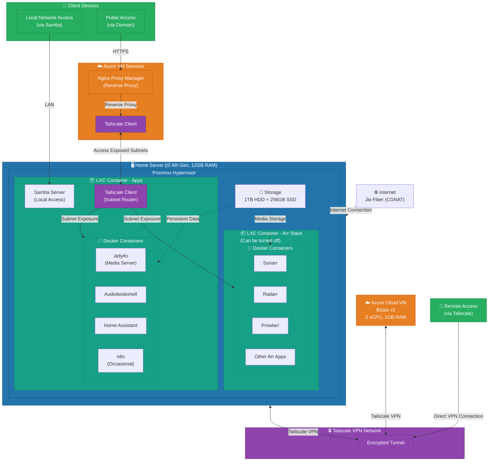

# proxmox-homelab
To document the progress of my homelab.

# Architecture

```mermaid
graph TB
    JioFiber["🌐 Internet<br/>Jio Fiber (CGNAT)"]
    Azure["☁️ Azure Cloud VM<br/>B2ats v2<br/>2 vCPU, 1GB RAM"]

    subgraph Tailscale["🔒 Tailscale VPN Network"]
        TS_Link["Encrypted Tunnel"]
    end

    subgraph HomeServer["🖥️ Home Server (i3 4th Gen, 12GB RAM)"]
        subgraph Proxmox["Proxmox Hypervisor"]
            Storage["💾 Storage<br/>1TB HDD + 256GB SSD"]
            
            subgraph LXC_Apps["📦 LXC Container - Apps"]
                TS_Client["Tailscale Client<br/>(Subnet Router)"]
                Samba["Samba Server<br/>(Local Access)"]
                
                subgraph Docker_Apps["🐳 Docker Containers"]
                    Jellyfin["Jellyfin<br/>(Media Server)"]
                    Audiobook["Audiobookshelf"]
                    HomeAssist["Home Assistant"]
                    N8N["n8n<br/>(Occasional)"]
                end
            end
            
            subgraph LXC_Arr["📦 LXC Container - Arr Stack<br/>(Can be turned off)"]
                subgraph Docker_Arr["🐳 Docker Containers"]
                    Sonarr["Sonarr"]
                    Radarr["Radarr"]
                    Prowlarr["Prowlarr"]
                    ArrOthers["Other Arr Apps"]
                end
            end
        end
    end

    subgraph Cloud["☁️ Azure VM Services"]
        NPM["Nginx Proxy Manager<br/>(Reverse Proxy)"]
        TS_Cloud["Tailscale Client"]
    end

    subgraph Clients["👥 Client Devices"]
        Local["Local Network Access<br/>(via Samba)"]
        Public["Public Access<br/>(via Domain)"]
    end

    Remote["👥 Remote Access<br/>(via Tailscale)"]

    %% Connections
    JioFiber -->|Internet Connection| HomeServer
    
    Azure <-->|Tailscale VPN| TS_Link
    HomeServer <-->|Tailscale VPN| TS_Link
    
    TS_Client -->|Subnet Exposure| Docker_Apps
    TS_Client -->|Subnet Exposure| Docker_Arr
    
    TS_Cloud <-->|Access Exposed Subnets| TS_Client
    NPM -->|Reverse Proxy| TS_Cloud
    
    Public -->|HTTPS| NPM
    Remote -->|Direct VPN Connection| TS_Link
    Local -->|LAN| Samba
    
    Storage -.->|Persistent Data| Docker_Apps
    Storage -.->|Media Storage| Docker_Arr

    classDef serverStyle fill:#2374ab,stroke:#1a5276,color:#fff
    classDef containerStyle fill:#16a085,stroke:#138d75,color:#fff
    classDef cloudStyle fill:#e67e22,stroke:#d35400,color:#fff
    classDef networkStyle fill:#8e44ad,stroke:#6c3483,color:#fff
    classDef clientStyle fill:#27ae60,stroke:#1e8449,color:#fff
    
    class HomeServer,Proxmox serverStyle
    class LXC_Apps,LXC_Arr,Docker_Apps,Docker_Arr containerStyle
    class Azure,Cloud,NPM cloudStyle
    class Tailscale,TS_Link,TS_Client,TS_Cloud networkStyle
    class Clients,Remote,Local,Public clientStyle
```
