# Proxmox Homelab

A documentation of my personal homelab infrastructure built on Proxmox, showcasing container orchestration, networking, and cloud integration.

## Overview

This homelab demonstrates a production-like setup handling the challenge of ISP CGNAT (Carrier-Grade NAT) restrictions by leveraging Tailscale VPN and Azure cloud infrastructure for remote access and public service exposure.

## Hardware

- **CPU**: Intel i3 4th Generation
- **RAM**: 12GB
- **Storage**: 1TB HDD + 256GB SSD
- **Hypervisor**: Proxmox VE

## Architecture

```mermaid
graph TB
    JioFiber["🌐 Internet<br/>Jio Fiber (CGNAT)"]
    Azure["☁️ Azure Cloud VM<br/>B2ats v2<br/>2 vCPU, 1GB RAM"]
    
    subgraph Tailscale["🔒 Tailscale VPN Network"]
        TS_Link["Encrypted Tunnel"]
    end
    
    subgraph HomeServer["🖥️ Home Server (i3 4th Gen, 12GB RAM)"]
        subgraph Proxmox["Proxmox Hypervisor"]
            Storage["💾 Storage<br/>1TB HDD + 256GB SSD"]
            
            subgraph LXC_Apps["📦 LXC Container - Apps"]
                TS_Client["Tailscale Client<br/>(Subnet Router)"]
                Samba["Samba Server<br/>(Local Access)"]
                
                subgraph Docker_Apps["🐳 Docker Containers"]
                    Jellyfin["Jellyfin<br/>(Media Server)"]
                    Audiobook["Audiobookshelf"]
                    HomeAssist["Home Assistant"]
                    N8N["n8n<br/>(Occasional)"]
                end
            end
            
            subgraph LXC_Arr["📦 LXC Container - Arr Stack<br/>(Can be turned off)"]
                subgraph Docker_Arr["🐳 Docker Containers"]
                    Sonarr["Sonarr"]
                    Radarr["Radarr"]
                    Prowlarr["Prowlarr"]
                    ArrOthers["Other Arr Apps"]
                end
            end
        end
    end
    
    subgraph Cloud["☁️ Azure VM Services"]
        NPM["Nginx Proxy Manager<br/>(Reverse Proxy)"]
        TS_Cloud["Tailscale Client"]
    end
    
    subgraph Clients["👥 Client Devices"]
        Local["Local Network Access<br/>(via Samba)"]
        Public["Public Access<br/>(via Domain)"]
    end
    
    Remote["👥 Remote Access<br/>(via Tailscale)"]
    
    %% Connections
    JioFiber -->|Internet Connection| HomeServer
    Azure <-->|Tailscale VPN| TS_Link
    HomeServer <-->|Tailscale VPN| TS_Link
    TS_Client -->|Subnet Exposure| Docker_Apps
    TS_Client -->|Subnet Exposure| Docker_Arr
    TS_Cloud <-->|Access Exposed Subnets| TS_Client
    NPM -->|Reverse Proxy| TS_Cloud
    Public -->|HTTPS| NPM
    Remote -->|Direct VPN Connection| TS_Link
    Local -->|LAN| Samba
    Storage -.->|Persistent Data| Docker_Apps
    Storage -.->|Media Storage| Docker_Arr
    
    classDef serverStyle fill:#2374ab,stroke:#1a5276,color:#fff
    classDef containerStyle fill:#16a085,stroke:#138d75,color:#fff
    classDef cloudStyle fill:#e67e22,stroke:#d35400,color:#fff
    classDef networkStyle fill:#8e44ad,stroke:#6c3483,color:#fff
    classDef clientStyle fill:#27ae60,stroke:#1e8449,color:#fff
    
    class HomeServer,Proxmox serverStyle
    class LXC_Apps,LXC_Arr,Docker_Apps,Docker_Arr containerStyle
    class Azure,Cloud,NPM cloudStyle
    class Tailscale,TS_Link,TS_Client,TS_Cloud networkStyle
    class Clients,Remote,Local,Public clientStyle
```

## Key Features

### Network Architecture
- **CGNAT Workaround**: Used Tailscale VPN mesh network to bypass ISP CGNAT restrictions
- **Public Access**: Azure VM running Nginx Proxy Manager for reverse proxy to homelab services
- **Subnet Routing**: Tailscale subnet router exposes internal Docker networks

### Services Running
- **Jellyfin**: Personal media streaming server
- **Audiobookshelf**: Audiobook and podcast server
- **Home Assistant**: Home automation platform
- **n8n**: Workflow automation (on-demand)
- **Arr Stack**: Automated media management (Sonarr, Radarr, Prowlarr)
- **Samba**: Local network file sharing

### Infrastructure
- **Virtualization**: Proxmox VE for hypervisor
- **Containers**: LXC containers for isolation and resource efficiency
- **Orchestration**: Docker and Docker Compose for application deployment
- **Storage**: Separate HDD for media, SSD for applications

## Technologies Used

- Proxmox VE
- Docker & Docker Compose
- LXC (Linux Containers)
- Tailscale VPN
- Nginx Proxy Manager
- Azure Cloud (B2ats v2 VM)
- Samba

## Problem Solved

My ISP (Jio Fiber) uses CGNAT, which means I don't have a public IP address and cannot port-forward to access services remotely. To solve this:

1. Set up a Tailscale mesh VPN connecting homelab and Azure VM
2. Configured Tailscale subnet router on homelab to expose Docker networks
3. Deployed Nginx Proxy Manager on Azure VM as reverse proxy
4. Pointed domain to Azure VM's public IP
5. Result: Secure remote access and public-facing services without needing ISP cooperation

## Access Methods

- **Local Network**: Direct access via Samba and local IPs
- **Remote Access**: Tailscale VPN for secure direct connection
- **Public Services**: HTTPS through domain → Azure VM → Tailscale → Homelab

---

*This is a personal learning project to gain hands-on experience with enterprise-level infrastructure, networking, and cloud integration.*
