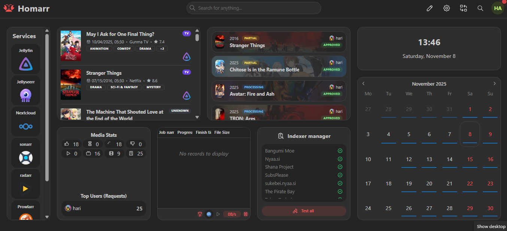

# Homarr

A modern, customizable dashboard for organizing and accessing all your self-hosted services from a single interface.



## Overview

Homarr provides a centralized hub with:
- Drag-and-drop dashboard organization
- Real-time service status monitoring
- Docker integration for automatic service discovery
- Beautiful widgets and themes
- Mobile-responsive design

**Official Documentation:** https://homarr.dev

## Quick Start

### 1. Generate Encryption Key
```bash
openssl rand -base64 32
```

### 2. Update Configuration
Edit `compose.yaml` and replace the empty `SECRET_ENCRYPTION_KEY` with your generated key.

### 3. Create Data Directory
```bash
mkdir -p homarr/appdata
```

### 4. Start Homarr
```bash
docker compose up -d
```

### 5. Access Dashboard
Open `http://<host>:7575` in your browser.

## Initial Setup

### First-Time Configuration
1. Choose your preferred language
2. Set a dashboard name
3. Select a theme (light/dark)
4. Choose a grid layout

### Adding Services

#### Manual Addition
1. Click "Add Tile" on the dashboard
2. Select "Service" tile type
3. Configure:
   - **Name:** Service display name
   - **URL:** Full service URL (e.g., `http://192.168.1.100:7878`)
   - **Icon:** Choose from built-in icons
   - **Description:** Optional description

#### Docker Integration (Recommended)
1. Go to Settings → Docker Integration
2. Enable Docker discovery
3. Select containers to add as services

### Common Service URLs
- Radarr: `http://<host>:7878`
- Sonarr: `http://<host>:8989`
- Bazarr: `http://<host>:6767`
- qBittorrent: `http://<host>:8080`
- Jellyseerr: `http://<host>:5055`
- Jellyfin: `http://<host>:8096`

## Widgets

Add useful widgets to your dashboard:
- **Date/Time:** Customizable clock
- **Weather:** Real-time weather information
- **Search:** Integrated search engine
- **Docker Stats:** Container resource usage
- **System Info:** CPU, memory, disk usage

## Customization

### Themes
- Built-in themes: Default, Nord, Dracula
- Custom color schemes
- Light/dark mode toggle

### Layout
- Adjustable grid sizes
- Custom tile sizes
- Drag-and-drop organization
- Categories for grouping services

## Configuration

All settings stored in `homarr/appdata/`:
- `configurations.json`: Dashboard layout
- `settings.json`: App preferences

### Backup
```bash
tar -czf homarr-backup-$(date +%Y%m%d).tar.gz homarr/appdata/
```

## Security

- Keep `SECRET_ENCRYPTION_KEY` secure
- Use reverse proxy with SSL for external access
- Enable authentication for production use
- Regular updates for security patches

## Troubleshooting

**Services not loading:** Check URLs and network connectivity
**Docker integration issues:** Verify socket mounting
**Lost configuration:** Check `/appdata` volume mounting

**View logs:**
```bash
docker compose logs -f homarr
```

## Support

- **GitHub:** https://github.com/homarr-labs/homarr
- **Documentation:** https://homarr.dev
- **Discord:** Community support and feature requests
