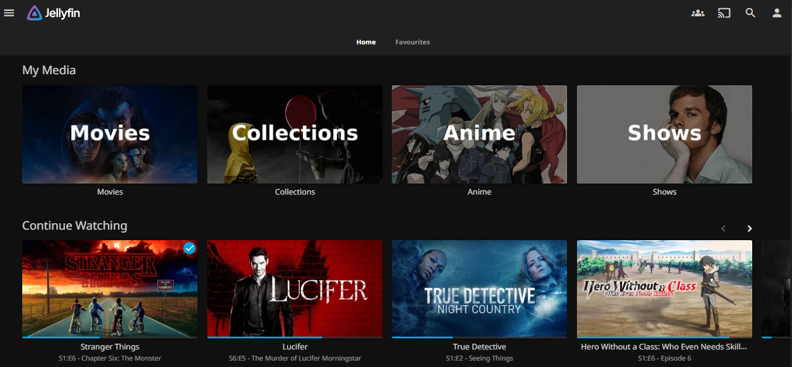

# Jellyfin

A free, open-source media server that organizes your media files and streams them to any device. Jellyfin is the perfect alternative to proprietary media servers, giving you full control over your media library.



## Overview

Jellyfin provides:
- **Media Organization:** Automatic metadata fetching and artwork
- **Multi-Device Streaming:** Web, mobile apps, TV apps, and more
- **User Management:** Multiple users with individual profiles and permissions
- **Live TV & DVR:** Optional live television recording and streaming
- **Plugin System:** Extensible functionality through community plugins
- **Transcoding:** On-the-fly media conversion for any device
- **Subtitles:** Comprehensive subtitle support

**Official Documentation:** https://jellyfin.org/docs

## Quick Start

### 1. Create Directories
```bash
mkdir -p config cache
```

### 2. Start Jellyfin
```bash
docker compose up -d
```

### 3. Access Web Interface
Open `http://<host>:8096` in your browser.

## Initial Setup

### First-Time Wizard
1. **Language Selection:** Choose your preferred language
2. **User Account:** Create your first admin user account
3. **Media Libraries:** Add your media folders
4. **Metadata:** Set metadata download preferences
5. **Remote Access:** Configure external access settings

### Adding Media Libraries

#### Movies Library
1. Click "+" → "Media Library"
2. Select "Movies" as content type
3. Set folder path: `/media/movies`
4. Enable "Allow real-time monitoring"
5. Choose metadata download options

#### TV Shows Library
1. Click "+" → "Media Library"
2. Select "TV shows" as content type
3. Set folder path: `/media/tv`
4. Enable "Allow real-time monitoring"
5. Configure season/episode naming preferences

#### Music Library
1. Click "+" → "Media Library"
2. Select "Music" as content type
3. Set folder path: `/media/music`
4. Enable "Allow real-time monitoring"
5. Configure artist/album metadata

## User Management

### Creating Users
1. Go to Dashboard → Users
2. Click "+" to add new user
3. Set username and password
4. Configure permissions:
   - **Access:** Allowed libraries
   - **Parental Controls:** Content ratings
   - **Playback:** Quality limits

### User Roles
- **Admin:** Full access to all settings
- **User:** Media access only
- **Guest:** Limited access with restrictions

## Recommended Plugins

### Essential Plugins
1. **Open Subtitles:** Automatic subtitle downloads
2. **Trakt:** Progress tracking and social features
3. **TMDb Box Sets:** Movie collection organization
4. **AudioDB:** Enhanced music metadata
5. **Bookshelf:** Book/audiobook support

### Installing Plugins
1. Go to Dashboard → Plugins
2. Browse "Catalog" or "Repositories"
3. Click install on desired plugins
4. Restart Jellyfin after installation

## Playback Settings

### Transcoding
- **Hardware Acceleration:** Enable GPU transcoding if available
- **Quality Settings:** Configure bitrate and resolution limits
- **Subtitle Encoding:** Set subtitle burn-in preferences

### Streaming Quality
- **Remote Access:** Lower quality for external streaming
- **Local Network:** Maximum quality for home streaming
- **Mobile Devices:** Optimized profiles for phones/tablets

## Network Configuration

### Local Access
- Default port: 8096
- Automatic service discovery on local network
- Direct IP access: `http://<ip>:8096`

### External Access
- Configure port forwarding on router (port 8096)
- Set up reverse proxy with SSL certificate
- Enable secure connections in Jellyfin settings

## Client Apps

### Official Apps
- **Web Browser:** Full-featured web interface
- **Android:** Google Play Store
- **iOS:** Apple App Store
- **Windows:** Microsoft Store
- **macOS:** Native desktop application
- **TV Apps:** Android TV, Apple TV, Roku, Fire TV

### Third-Party Clients
- **Finamp:** Music-focused Android app
- **Jellyfin Media Player:** Cross-platform desktop client
- **Swiftfin:** Native iOS/tvOS app

## Configuration Files

All settings stored in `config/` directory:
- `library.db`: Media library database
- `users.db`: User accounts and preferences
- `metadata/`: Downloaded metadata and images
- `plugins/`: Installed plugins

### Backup Configuration
```bash
tar -czf jellyfin-backup-$(date +%Y%m%d).tar.gz config/
```

## Performance Optimization

### Hardware Acceleration
Enable GPU transcoding for better performance:
- **NVIDIA:** NVIDIA GPU transcoding
- **Intel:** Intel Quick Sync Video
- **AMD:** AMD VCE/VCN

### Storage Optimization
- Use SSD for cache directory
- Separate media storage from system drive
- Regular cleanup of transcode temp files

## Security

### Best Practices
- Enable HTTPS with reverse proxy
- Use strong passwords for all accounts
- Regularly update Jellyfin to latest version
- Configure firewall rules for port 8096
- Monitor access logs for suspicious activity

### Authentication
- Two-factor authentication (2FA) support
- LDAP/Active Directory integration
- API key management for third-party apps

## Troubleshooting

### Common Issues
- **Media not detected:** Check file permissions and folder structure
- **Playback issues:** Verify codec support and transcoding settings
- **Slow performance:** Enable hardware acceleration
- **Network access:** Check firewall and port forwarding

### Logs
```bash
docker compose logs -f jellyfin
```

### Reset Admin Password
```bash
docker compose exec jellyfin jellyfin --reset-admin-password
```

## Integration with ARR Stack

Jellyfin works seamlessly with your ARR stack:
- **Radarr:** Automatically adds downloaded movies to library
- **Sonarr:** Adds TV episodes as they're downloaded
- **Bazarr:** Subtitles appear automatically in Jellyfin
- **Jellyseerr:** Users can request content that appears in Jellyfin

## Support

- **Website:** https://jellyfin.org
- **Documentation:** https://jellyfin.org/docs
- **GitHub:** https://github.com/jellyfin/jellyfin
- **Reddit:** r/jellyfin for community support
- **Discord:** Official Jellyfin Discord server