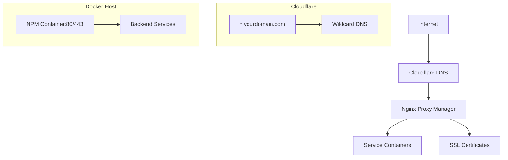

# Nginx Proxy Manager with Cloudflare Wildcard Domain

This guide walks through deploying Nginx Proxy Manager (NPM) and configuring it with Cloudflare using a wildcard domain for easy subdomain management.

## Prerequisites

- Cloudflare account with a registered domain
- Docker and Docker Compose installed
- Server with public IP address
- Port 80 and 443 accessible from the internet

## Architecture Overview



## Step 1: Cloudflare Configuration

### 1.1 Add Domain to Cloudflare
1. Sign in to Cloudflare dashboard
2. Add your domain and follow the setup wizard
3. Update your domain nameservers to Cloudflare's nameservers

### 1.2 Create Wildcard DNS Record
1. Go to DNS section in Cloudflare
2. Add a new DNS record:
   - **Type**: `A`
   - **Name**: `*` (wildcard)
   - **IPv4 address**: Your server's public IP
   - **Proxy status**: Proxied (orange cloud)
   - **TTL**: Auto

### 1.3 Configure SSL/TLS
1. Go to SSL/TLS section
2. Set encryption mode to **Full (strict)**
3. Enable **Always Use HTTPS**
4. Enable **Automatic HTTPS Rewrites**

### 1.4 Get API Token
1. Go to **My Profile** → **API Tokens**
2. Create token with permissions:
   - Zone:Zone:Read
   - Zone:DNS:Edit
   - Zone Resources:Include:All zones

## Step 2: Docker Compose Setup

Create `docker-compose.yml`:

```yaml
version: '3.8'

services:
  npm:
    image: 'jc21/nginx-proxy-manager:latest'
    container_name: nginx-proxy-manager
    restart: unless-stopped
    ports:
      - '80:80'    # Public HTTP
      - '443:443'  # Public HTTPS
      - '81:81'    # Admin interface
    volumes:
      - ./data:/data
      - ./letsencrypt:/etc/letsencrypt
    environment:
      - TZ=Asia/Kolkata
      - PUID=1000
      - PGID=1000
    networks:
      - npm-network

networks:
  npm-network:
    driver: bridge
```

## Step 3: Deploy Nginx Proxy Manager

### 3.1 Create Directory Structure
```bash
mkdir -p nginx-proxy-manager/{data,letsencrypt}
cd nginx-proxy-manager
```

### 3.2 Start the Service
```bash
docker-compose up -d
```

### 3.3 Access Admin Panel
1. Open browser: `http://your-server-ip:81`
2. Default credentials:
   - **Email**: `admin@example.com`
   - **Password**: `changeme`
3. Change default credentials immediately

## Step 4: Initial NPM Configuration

### 4.1 Set Default SSL Certificate
1. Go to **SSL Certificates** → **Add SSL Certificate**
2. Select **Let's Encrypt** certificate
3. Enter your domain (e.g., `yourdomain.com`)
4. Add email for certificate notifications
5. Enable **Force SSL** and **HTTP/2 Support**

### 4.2 Configure Default Proxy Host
1. Go to **Hosts** → **Proxy Hosts**
2. Create a default host for catch-all:
   - **Domain Names**: `yourdomain.com`
   - **Scheme**: `http`
   - **Forward Hostname/IP**: `1.1.1.1` (Cloudflare DNS)
   - **Forward Port**: `80`
   - **Block Common Exploits**: Enabled
   - **Websockets Support**: Enabled

## Step 5: Adding Services with Wildcard Subdomains

### 5.1 Example: Add Jellyfin Service
1. Go to **Hosts** → **Proxy Hosts** → **Add Proxy Host**
2. Configure:
   - **Domain Names**: `jellyfin.yourdomain.com`
   - **Scheme**: `http`
   - **Forward Hostname/IP**: `jellyfin` (container name)
   - **Forward Port**: `8096`
   - **SSL Certificate**: Select your Let's Encrypt cert
   - **Force SSL**: Enabled
   - **HTTP/2 Support**: Enabled

### 5.2 Example: Add Homarr Dashboard
1. **Domain Names**: `homarr.yourdomain.com`
2. **Forward Hostname/IP**: `homarr`
3. **Forward Port**: `7575`

### 5.3 Custom Headers (Optional)
Add custom headers in the **Custom Locations** tab:
```nginx
# Security headers
X-Frame-Options: SAMEORIGIN
X-Content-Type-Options: nosniff
X-XSS-Protection: 1; mode=block
Referrer-Policy: strict-origin-when-cross-origin

# CORS headers (if needed)
Access-Control-Allow-Origin: *
Access-Control-Allow-Methods: GET, POST, OPTIONS
Access-Control-Allow-Headers: DNT,User-Agent,X-Requested-With,If-Modified-Since,Cache-Control,Content-Type,Range
```

## Step 6: Advanced Configuration

### 6.1 Rate Limiting
Add to proxy host configuration:
```nginx
# Rate limiting
limit_req_zone $binary_remote_addr zone=api:10m rate=10r/s;
limit_req zone=api burst=20 nodelay;
```

### 6.2 IP Whitelisting (Admin Access)
Restrict admin panel access:
```nginx
# In NPM advanced tab for admin host
allow 192.168.1.0/24;
allow your.home.ip;
deny all;
```

### 6.3 Custom Error Pages
Create custom error pages in `data/custom_error_pages/`:
```html
<!DOCTYPE html>
<html>
<head><title>Service Unavailable</title></head>
<body>
    <h1>Service Temporarily Unavailable</h1>
    <p>Please try again later.</p>
</body>
</html>
```

## Step 7: Backup and Maintenance

### 7.1 Backup Configuration
```bash
# Backup NPM data
tar -czf npm-backup-$(date +%Y%m%d).tar.gz data/ letsencrypt/

# Automated backup script
#!/bin/bash
BACKUP_DIR="/path/to/backups"
DATE=$(date +%Y%m%d_%H%M%S)
docker-compose down
tar -czf "$BACKUP_DIR/npm-$DATE.tar.gz" data/ letsencrypt/
docker-compose up -d
find "$BACKUP_DIR" -name "npm-*.tar.gz" -mtime +7 -delete
```

### 7.2 Certificate Renewal
NPM automatically handles Let's Encrypt renewal, but monitor:
```bash
# Check certificate expiry
docker exec nginx-proxy-manager certbot certificates
```

## Troubleshooting

### Common Issues

1. **502 Bad Gateway**
   - Check if backend service is running
   - Verify container network connectivity
   - Check port mappings

2. **SSL Certificate Issues**
   - Ensure DNS propagation is complete
   - Check Cloudflare proxy status (orange cloud)
   - Verify port 80 is accessible for Let's Encrypt challenges

3. **Subdomain Not Working**
   - Check DNS propagation: `dig subdomain.yourdomain.com`
   - Verify Cloudflare DNS record exists
   - Check NPM proxy host configuration

### Useful Commands
```bash
# Check NPM logs
docker-compose logs -f npm

# Test DNS resolution
nslookup jellyfin.yourdomain.com

# Check SSL certificate
openssl s_client -connect jellyfin.yourdomain.com:443

# Restart NPM
docker-compose restart npm
```

## Security Best Practices

1. **Regular Updates**: Keep NPM image updated
2. **Strong Passwords**: Use unique, strong passwords for admin panel
3. **Access Control**: Restrict admin panel access to trusted IPs
4. **SSL Only**: Always enforce HTTPS for external services
5. **Monitor Logs**: Regularly check access and error logs
6. **Backup Regularly**: Automate backup of configuration and certificates

## Environment Variables

Create `.env` file for sensitive data:
```bash
# Cloudflare API Token (optional, for DNS challenges)
CLOUDFLARE_TOKEN=your_api_token_here

# Database credentials (if using external DB)
DB_MYSQL_HOST=mysql
DB_MYSQL_PORT=3306
DB_MYSQL_USER=npm
DB_MYSQL_PASSWORD=secure_password
DB_MYSQL_NAME=npm
```

## Performance Optimization

1. **Enable HTTP/2**: Improves loading performance
2. **Gzip Compression**: Enable in NPM advanced settings
3. **Browser Caching**: Set appropriate cache headers
4. **CDN Integration**: Use Cloudflare caching for static content

## Migration Guide

If migrating from existing setup:
1. Export existing NPM configuration
2. Backup current certificates
3. Update DNS records to point to new server
4. Import configuration and test
5. Update DNS TTL gradually to minimize downtime

## Support

- [Nginx Proxy Manager Documentation](https://nginxproxymanager.com/)
- [Cloudflare Documentation](https://developers.cloudflare.com/)
- [Docker Compose Documentation](https://docs.docker.com/compose/)

---

**Note**: This setup assumes you have a static public IP. For dynamic IPs, consider using Cloudflare's Dynamic DNS or a DDNS service.