# Homelab Architecture Documentation

## Overview
This document describes the complete architecture of a self-hosted homelab infrastructure utilizing Proxmox virtualization, Tailscale VPN networking, and Azure cloud bridging to bypass CGNAT restrictions.

## Hardware Specifications

### Main Server (Proxmox Host-Old PC)
- **Processor**: Intel i3 4th Generation
- **RAM**: 12GB DDR3
- **Storage**:
  - 256GB SSD - Proxmox OS and boot drive
  - 1TB HDD - Shared storage for media and application data
- **Network**: Jio Fiber (CGNAT)
- **Hypervisor**: Proxmox VE

### Cloud Infrastructure
- **Provider**: Microsoft Azure (Student Pack)
- **Instance Type**: Standard B2ats v2
- **Specifications**:
  - 2 vCPU
  - 1GB RAM
  - Standard Storage
  - Region: India
- **Operating System**: Ubuntu Server
- **Purpose**: Public-facing reverse proxy and CGNAT bypass

## Network Architecture

### Network Topology
```
Internet (Public Domain)
    ↓
Azure VM (Public IP) - Reverse Proxy (NPM)
    ↓
Tailscale VPN Mesh Network
    ↓
Home Server (10.42.42.0/24)
    ↓
Proxmox Hypervisor
    ├── LXC 1: arr-stack (10.42.42.10)
    └── LXC 2: main-apps (10.42.42.20)
```

### IP Addressing Scheme
- **Home Network Range**: 10.42.42.0/24
- **arr-stack LXC**: 10.42.42.10 (Static)
- **main-apps LXC**: 10.42.42.20 (Static)
- **Tailscale Subnet**: Advertised from home server to Azure VM

### Network Services
1. **Tailscale VPN**
   - Mesh networking between Azure VM and home server
   - Subnet routing enabled for home network access
   - Used for remote administration and service exposure

2. **Reverse Proxy (Nginx Proxy Manager)**
   - Deployed on Azure VM via Docker
   - Wildcard SSL certificate for domain
   - Subdomain routing to internal services via Tailscale

3. **Samba Server**
   - Running in main-apps LXC
   - Provides local network file sharing
   - Accesses shared 1TB storage

## Virtualization Infrastructure

### Proxmox Configuration
- **Host OS**: Proxmox VE on 256GB SSD
- **Storage Pools**:
  - Local SSD: Container OS and critical configs
  - 1TB HDD: Shared data storage for all LXCs

### LXC Container 1: arr-stack
- **IP Address**: 10.42.42.10
- **Resources**:
  - CPU: 1 core
  - RAM: 3GB
  - Storage: OS on SSD, data on shared 1TB HDD
- **Services**:
  - Sonarr - TV show management
  - Radarr - Movie management
  - Prowlarr - Indexer management
  - qBittorrent/Transmission - Download client
  - Bazarr - Subtitle management (optional)
- **Configuration**:
  - All services run in Docker containers via Docker Compose
  - Can be powered off when not actively downloading
  - Accesses shared media storage

### LXC Container 2: main-apps
- **IP Address**: 10.42.42.20
- **Resources**:
  - CPU: 3 cores
  - RAM: 10GB
  - Storage: OS on SSD, data on shared 1TB HDD
- **Services**:
  - Jellyfin - Media server
  - Audiobookshelf - Audiobook and podcast server
  - Home Assistant - Home automation platform
  - n8n - Workflow automation (occasional use)
  - Tailscale - VPN client for subnet routing
  - Samba - Local file sharing
- **Configuration**:
  - All services run in Docker containers via Docker Compose
  - Always running for media streaming and home automation
  - Handles Tailscale subnet advertisement

## Service Architecture

### Docker Configuration
- **Orchestration**: Docker Compose for all services
- **Shared Storage**: 1TB HDD mounted to both LXCs
- **Network Mode**: Bridge networking with port mappings
- **Volume Strategy**: Bind mounts to shared storage for persistence

### Service Exposure Flow
1. User requests service via subdomain (e.g., jellyfin.yourdomain.com)
2. DNS resolves to Azure VM public IP
3. NPM on Azure VM receives HTTPS request
4. Request routed through Tailscale VPN to home server
5. NPM proxies to appropriate LXC service via internal IP (10.42.42.x)
6. Service responds back through the same path

### Domain Management
- **Registrar**: GitHub Student Developer Pack
- **Configuration**: Wildcard DNS (*.yourdomain.com → Azure VM IP)
- **SSL**: Let's Encrypt certificates managed by NPM
- **Subdomains**: One per service for clean organization

## Storage Architecture

### Storage Layout
```
Proxmox Host
├── 256GB SSD
│   ├── Proxmox OS
│   ├── LXC OS filesystems
│   └── Critical configurations
└── 1TB HDD (Shared)
    ├── Media Library (Movies, TV, Music, Audiobooks)
    ├── Application Data
    ├── Docker Volumes
    └── Samba Shares
```

### Access Patterns
- **Local Access**: Via Samba shares on home network
- **Remote Access**: Via Jellyfin/Audiobookshelf through reverse proxy
- **Management**: Direct access via Tailscale VPN

## Security Considerations

### Current Security Measures
1. **CGNAT Bypass**: No direct port forwarding to home network
2. **VPN Tunneling**: All traffic encrypted via Tailscale
3. **Reverse Proxy**: Single point of entry with SSL termination
4. **Container Isolation**: Services isolated in Docker containers
5. **LXC Separation**: arr-stack separated from always-on services

### Access Control
- **Remote Access**: Through Tailscale authenticated devices only
- **Public Services**: Exposed via Azure VM reverse proxy
- **Local Network**: Samba for trusted devices only

## Service Dependencies

### Critical Path Services
1. **Tailscale** (main-apps LXC) - Required for all remote access
2. **NPM** (Azure VM) - Required for public service access
3. **Docker** (both LXCs) - Required for all application services

### Service Relationships
```
Jellyfin → 1TB Storage (media)
Audiobookshelf → 1TB Storage (audiobooks)
Sonarr/Radarr → 1TB Storage (media) + qBittorrent
Home Assistant → Independent (smart home devices)
n8n → Can integrate with any service
```

## Operational Characteristics

### Always-On Services
- Proxmox host
- main-apps LXC (10.42.42.20)
- Azure VM
- Jellyfin, Audiobookshelf, Home Assistant, Tailscale, Samba

### On-Demand Services
- arr-stack LXC (10.42.42.10) - can be shut down when not downloading
- n8n - occasional use

### Remote Management
- **Proxmox Web UI**: Via Tailscale (https://10.42.42.1:8006)
- **Container Management**: SSH via Tailscale
- **Service Dashboards**: Via reverse proxy subdomains or direct Tailscale access

## Advantages of This Architecture

1. **CGNAT Workaround**: Cloud VM provides public endpoint without exposing home network
2. **Low Cloud Costs**: Minimal resources needed for reverse proxy only
3. **Secure**: No direct exposure of home network, all traffic through VPN
4. **Flexible**: Easy to add/remove services via Docker Compose
5. **Scalable**: Can upgrade home hardware independently of cloud infrastructure
6. **Remote Access**: Tailscale provides secure admin access from anywhere
7. **Resource Efficiency**: LXC containers are lightweight compared to VMs
8. **Service Isolation**: arr-stack can be powered down to save resources

## Current Limitations

1. **Azure VM Resources**: 1GB RAM limits what can run on cloud side
2. **Home Server CPU**: 4th gen i3 limits transcoding capabilities for Jellyfin
3. **No GPU**: Limited AI/ML capabilities, no hardware transcoding
4. **Storage**: 1TB may become insufficient for growing media library
5. **RAM**: 12GB shared between Proxmox and containers is tight
6. **Upload Speed**: Jio Fiber upload speeds may limit remote streaming quality

## Architecture diagram

```mermaid
graph TB
    JioFiber["🌐 Internet<br/>Jio Fiber (CGNAT)"]
    Azure["☁️ Azure Cloud VM<br/>B2ats v2<br/>2 vCPU, 1GB RAM"]

    subgraph Tailscale["🔒 Tailscale VPN Network"]
        TS_Link["Encrypted Tunnel"]
    end

    subgraph HomeServer["🖥️ Home Server (i3 4th Gen, 12GB RAM)"]
        subgraph Proxmox["Proxmox Hypervisor"]
            Storage["💾 Storage<br/>1TB HDD + 256GB SSD"]
            
            subgraph LXC_Apps["📦 LXC Container - Apps"]
                TS_Client["Tailscale Client<br/>(Subnet Router)"]
                Samba["Samba Server<br/>(Local Access)"]
                
                subgraph Docker_Apps["🐳 Docker Containers"]
                    Jellyfin["Jellyfin<br/>(Media Server)"]
                    Audiobook["Audiobookshelf"]
                    HomeAssist["Home Assistant"]
                    N8N["n8n<br/>(Occasional)"]
                end
            end
            
            subgraph LXC_Arr["📦 LXC Container - Arr Stack<br/>(Can be turned off)"]
                subgraph Docker_Arr["🐳 Docker Containers"]
                    Sonarr["Sonarr"]
                    Radarr["Radarr"]
                    Prowlarr["Prowlarr"]
                    ArrOthers["Other Arr Apps"]
                end
            end
        end
    end

    subgraph Cloud["☁️ Azure VM Services"]
        NPM["Nginx Proxy Manager<br/>(Reverse Proxy)"]
        TS_Cloud["Tailscale Client"]
    end

    subgraph Clients["👥 Client Devices"]
        Local["Local Network Access<br/>(via Samba)"]
        Public["Public Access<br/>(via Domain)"]
    end

    Remote["👥 Remote Access<br/>(via Tailscale)"]

    %% Connections
    JioFiber -->|Internet Connection| HomeServer
    
    Azure <-->|Tailscale VPN| TS_Link
    HomeServer <-->|Tailscale VPN| TS_Link
    
    TS_Client -->|Subnet Exposure| Docker_Apps
    TS_Client -->|Subnet Exposure| Docker_Arr
    
    TS_Cloud <-->|Access Exposed Subnets| TS_Client
    NPM -->|Reverse Proxy| TS_Cloud
    
    Public -->|HTTPS| NPM
    Remote -->|Direct VPN Connection| TS_Link
    Local -->|LAN| Samba
    
    Storage -.->|Persistent Data| Docker_Apps
    Storage -.->|Media Storage| Docker_Arr

    classDef serverStyle fill:#2374ab,stroke:#1a5276,color:#fff
    classDef containerStyle fill:#16a085,stroke:#138d75,color:#fff
    classDef cloudStyle fill:#e67e22,stroke:#d35400,color:#fff
    classDef networkStyle fill:#8e44ad,stroke:#6c3483,color:#fff
    classDef clientStyle fill:#27ae60,stroke:#1e8449,color:#fff
    
    class HomeServer,Proxmox serverStyle
    class LXC_Apps,LXC_Arr,Docker_Apps,Docker_Arr containerStyle
    class Azure,Cloud,NPM cloudStyle
    class Tailscale,TS_Link,TS_Client,TS_Cloud networkStyle
    class Clients,Remote,Local,Public clientStyle
```

